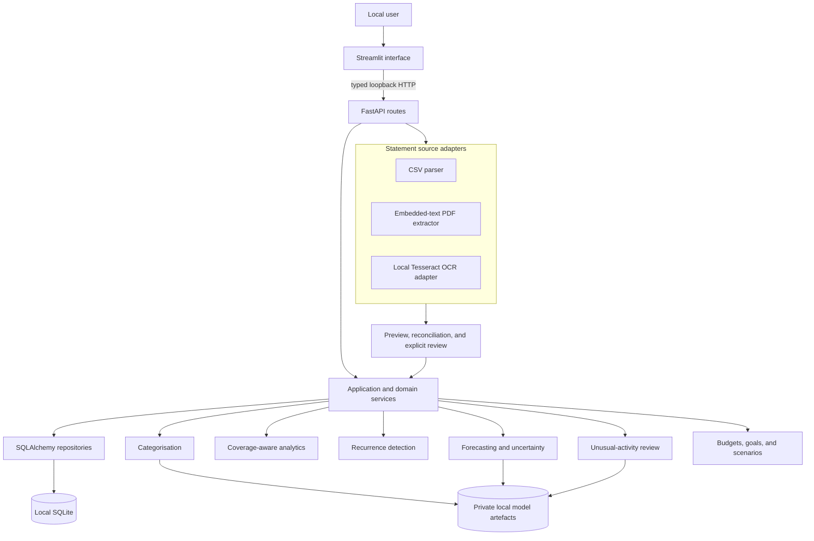
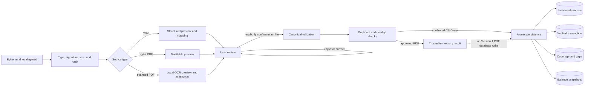
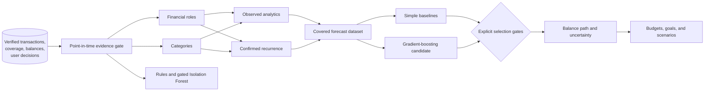
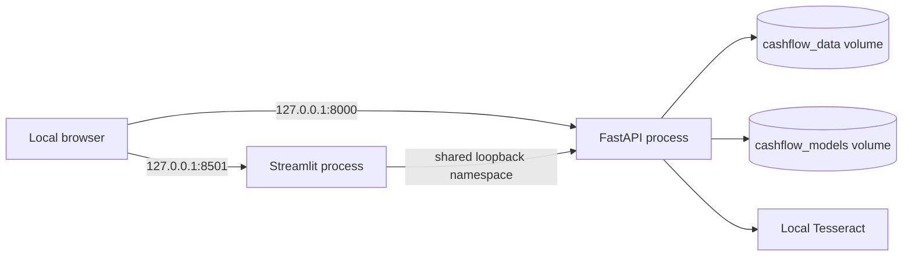

# Architecture and data-flow diagrams

These diagrams describe the Version 1 local modular monolith. Arrows show data or
control flow, not separate deployable microservices.

## Component architecture

Routes and Streamlit pages coordinate typed requests only. Financial rules stay in
services, source adapters do not write trusted transactions, and SQLAlchemy
repositories do not contain user-interface decisions.

## Statement trust flow

Every row remains represented. Malformed rows are quarantined, exact duplicates are
the only automatic exclusions, and probable duplicates wait for a decision. PDF
approval deliberately stops before persistence because the approved rows, rejected
evidence, balances, and coverage must eventually be saved as one transaction.

## Calculation and model flow

Information created after a historical cutoff cannot enter its training features,
labels, recurrence state, or evaluation. Missing statement coverage stays unknown.
An advanced model runs only when it beats an information-equivalent baseline under
the documented safeguards; otherwise an executable baseline remains in control.

## Local container topology

Both ports bind to loopback. The containers do not introduce a cloud database,
external OCR, Redis, Kafka, background worker, or deployment target.
